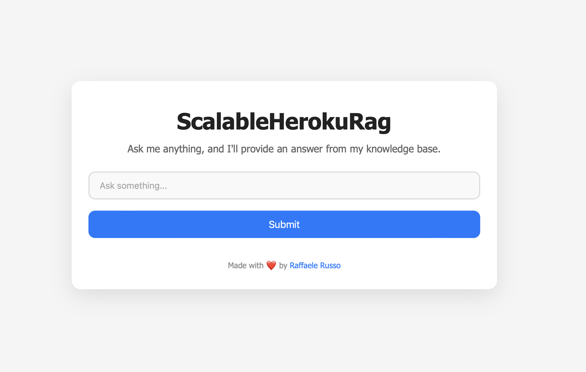

# ScalableHerokuRag


This project provides a scalable RAG (Retrieval Augmented Generation) service deployed on Heroku. It leverages Redis and Celery to queue the requests and LangChain and OpenAI for NLP tasks. You can run this locally for testing or deploy it to Heroku for scalability.

## Setup Instructions

### 0. Before you begin
Make sure to have a local server of Redis installed and running. You can either install Redis locally, use a cloud version, or run it in a container.

#### Local Installation:

For MacOS (via Homebrew):

```bash
brew install redis
```

For Linux (Ubuntu):

```bash
sudo apt-get update
sudo apt-get install redis-server
```

Start the Redis server:

```bash
redis-server
```

#### Cloud Version:

You can use a cloud-based Redis service like Redis Cloud or Redis Labs. Ensure you have the Redis URL provided by the service.

#### Container:

You can also run Redis in a Docker container:

```bash
docker run --name redis -d redis
```

Make sure to set the Redis URL in the environment variables in the next steps.
### 1. Clone the Repository

First, clone this repository to your local machine:

```bash
git clone https://github.com/raffaele-russo/ScalableRagHeroku.git
cd ScalableRagHeroku
```

### 2. Set Up Python Virtual Environment

Create and activate a Python virtual environment:

```bash
python3 -m venv venv
source venv/bin/activate 
```

### 3. Install Dependencies

Install the required Python dependencies:

```bash
pip install -r requirements.txt
```

### 4. Set Environment Variables

Create a `.env` file in the root directory of the project to set the following environment variables:

```ini
FILE_PATH="/path/to/your/file.pdf"
OPENAI_API_KEY="your-openai-api-key"
REDISTOGO_URL="your-redis-url"
```

### 5. Run Locally (Testing)

Once Redis is installed and the environment variables are set, you can run the application locally.

Start the web server (using Uvicorn):

```bash
fastapi dev main.py
```

Start the Celery worker:

```bash
celery -A worker.celery_app worker --loglevel=info
```

Both commands should be run in separate terminal windows or processes.

### 6. Connect to the Application

Once the web server and Celery worker are running, open your web browser and navigate to `http://localhost:8000` to use the application.


### 7. Heroku Deployment

To deploy to Heroku:

#### Create a Heroku App:

```bash
heroku create app-name
```

#### Add Redis Addon:

You can either use the RedisToGo add-on (free tier) or create your own Redis Cloud instance:

Using RedisToGo:

```bash
heroku addons:create redistogo:nano --app app-name
```

Using Redis Cloud:

1. Create a free-tier Redis database on Redis Cloud.
2. Set the environment variable `REDISTOGO_URL`:

```bash
heroku config:set REDISTOGO_URL="redis://your-redis-url" --app app-name
```

#### Open the App on Heroku:

```bash
heroku open --app app-name
```